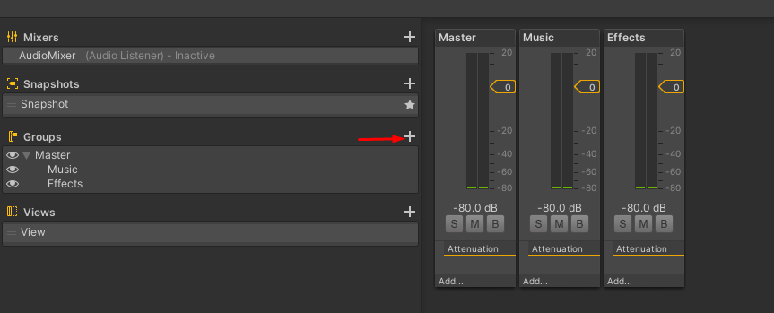
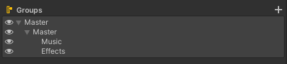
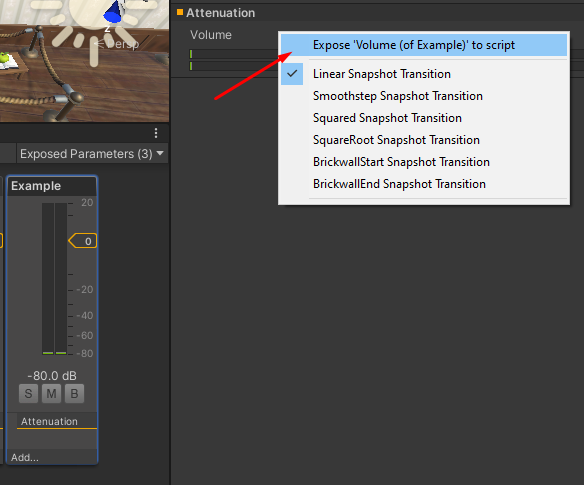

# Common Options

### Music Volume

A critical option, provides the ability to control the volume for all music related audio in the game. 

### Sound Effects Volume

Identical to [music volume](#music-volume), but for non-music related audio. Unless you plan on splitting sound effects further by category (voices, UI sounds, etc) it's a safe bet to control all sound effect volume through this option. 

### Master Volume

A common and desired option for most games is a master volume option. This option should have an effect on all audio sources for the game and will usually tie directly into the game engine's master volume mixer.

# Recipes

## Implementing Volume Controls

Controlling volume is a common problem to solve, and most modern game engines provide good support for implementing is the functionality. When jumping into engine specific solutions below, pay attention for commonalities between them as this may help cement your understanding.


These "guides" will assume you know the basic knowledge for creating a simple UI with a slider control that you can populate and observe with the player's volume setting.



In Unity, volume control starts by creating an [`AudioMixer`](https://docs.unity3d.com/Manual/AudioMixer.html) asset type. You can name your new `AudioMixer` asset whatever you like, but often _"AudioMixer"_ or _"DefaultMixer"_ is perfectly sufficient.

Once you've created the asset, double click to open the audio panel in Unity. Click the + (plus) icon next to the "Groups" section on the left hand side to add a new group. You'll actually want to add at least 2 groups here: [Music](#music-volume) and [Effects](#sound-effects-volume).

> If you want to support a custom [Master Volume](#master-volume) control that won't conflict with programmatic changes to the _actual_ master volume, you can create a custom "master" group and nest the other groups underneath that one.
>
> 

With your mixing groups created, it's time to expose the volume property for these groups. This is because you can add a variety of effects layer to audio mixing groups, and can expose various parameters for each of them to be manipulated via code. Select the graphical representation of the group in the mixer, then right-click on the volume setting in the inspector on the right hand side (by default). The first option should allow you to toggle the exposed state of the property. Once exposed, you'll be able to manipulate the group's volume via code.




TBD



TBD
