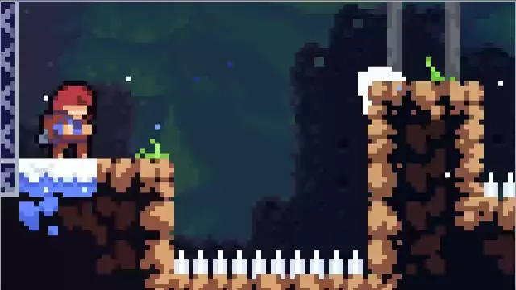
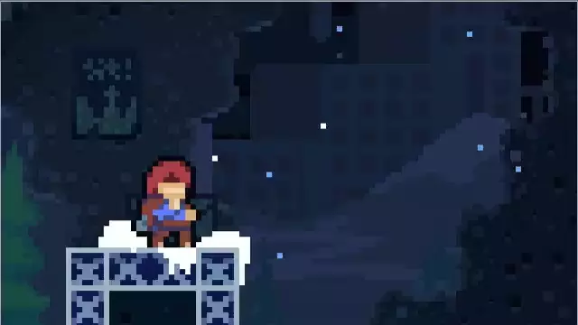

# Overview

_"Timing windows"_ relates to moments of time where user input is required to correctly accomplish a task. This might be related to making a job, performing a quick time event, hitting a note in a music/beat oriented game, etc. Rather than requiring perfect timing of the input (which may be near impossible in some cases), it's important to allow for a small buffer, or window of forgiveness, in which early or delayed input will still be accepted.

# Common Solutions

## Coyote Time

> This feature is most commonly seen in platformers, but may be useful in other game genres as well. For example, if you are making Doom: Eternal style FPS with a lot of platformer, support Coyote Time can help make tricky leaps less frustrating.

Coyote Time, sometimes referred to as "Coyote Frames", is an invisible feature that gives the player a small, extra window to make crucial jump, both for taking off and landing. It was comically named after cartoon character Wile E. Coyote, who routinely had issues with the laws of physics while trying to catch the Road Runner. Games without Coyote Time are often dismissed as “too hard” or “not fun.” Developers who managed to get it right would end up with games that are still beloved today.

_Paraphrased from [Coding Imprecise Controls to Make Them Feel More Precise](https://developer.amazon.com/blogs/appstore/post/9d2094ed-53cb-4a3a-a5cf-c7f34bca6cd3/coding-imprecise-controls-to-make-them-feel-more-precise)_

<!-- <blockquote class="twitter-tweet">
A short thread on a few Celeste game-feel things :) I don&#39;t think we invented any of these.  1- Coyote time. You can still jump for a short time after leaving a ledge. <a href="https://t.co/nMK9ZLYbhM">pic.twitter.com/nMK9ZLYbhM</a>
&mdash; Maddy Thorson (@MaddyThorson) <a href="https://twitter.com/MaddyThorson/status/1238338574220546049?ref_src=twsrc%5Etfw">March 13, 2020</a></blockquote>  -->

### Additional Resources

- [Twitter: Maddy Thorson's thread on Celese tricks](https://twitter.com/MaddyThorson/status/1238338574220546049?ref_src=twsrc%5Etfw)
- [r/todayilearned: "Coyote Time" is when game developers give players who walk off the edge of a cliff time before gravity kicks in to prevent rage quitting](https://www.reddit.com/r/todayilearned/comments/igiq25/til_coyote_time_is_when_game_developers_give/)

## Input Buffering

Input buffering is allowing the player (or any source of input) to input commands into the game and allow those commands to be effective for a short window of time after they are inputted. In the case of jump input buffering, the goal is to allow the player to input the jump button and still have a successful jump even if they mistimed their input by a tiny amount.

_Paraphrased from [Jump Input Buffering](http://kpulv.com/106/Jump_Input_Buffering/)._

### Additional Resources

- [Input Buffering (2D Platforming)](https://www.caseportman.com/single-post/2018/08/16/input-buffering-2d-platforming)
- [r/gamedev: Buffered Input (like that found in fighting games)](https://www.reddit.com/r/gamedev/comments/1iw22v/buffered_input_like_that_found_in_fighting_games/)
- [gamedev.net: Help understanding the concept of Input Buffering ](https://www.gamedev.net/forums/topic/704006-help-understanding-the-concept-of-input-buffering/)
- [Stack Exchange: Fighting Game and input buffering](https://gamedev.stackexchange.com/questions/43708/fighting-game-and-input-buffering)
- [QCF+Punch: Implementing Street Fighter-style Input](http://gamedevwithoutacause.com/?p=266)
