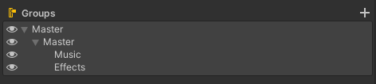
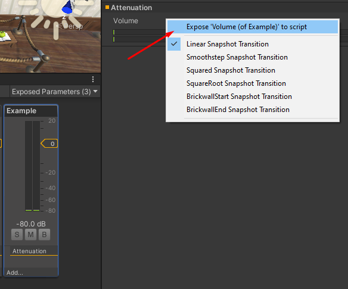

# Common Options

## Volume

Volume control is arguably the most important setting(s) to offer, ideally for more than just the "master" mix. This is because audio can play a substantial role in the accessibility of your game. See the following articles on accessibility for more info:

- [Cognitive]()
- [Hearing]()
- [Visual]()



Controlling volume is a common problem to solve, and most modern game engines provide good support for implementing is the functionality. Provided below are links to resources for the most popular, modern engines on how to implement volume controls.

- [Unity &rarr;](https://gamedevbeginner.com/the-right-way-to-make-a-volume-slider-in-unity-using-logarithmic-conversion/)
- [Godot &rarr;](https://www.gdquest.com/tutorial/godot/audio/volume-slider/)



### Master Mix

**Expected Feature** &ndash; A common and desired option for most games is a master volume option. This option should have an effect on all audio sources for the game and will usually tie directly into the game engine's master volume mixer.

### Music

**Expected Feature** &ndash; A critical option, provides the ability to control the volume for all music related audio in the game. 

### Sound Effects

**Expected Feature** &ndash; Identical to [music volume](#music), but for non-music related audio. Unless you plan on splitting sound effects further by category (voices, UI sounds, etc) it's a safe bet to control all sound effect volume through this option. 

## Subtitles

[Related: Hearing &rarr;]()

An important feature for accessibility purposes is [subtitles](https://en.wikipedia.org/wiki/Subtitles). Adding subtitles is obviously important for players who are deaf or hard of hearing, but can also be useful for games where there may be important narrative or contextual information being relayed via sound (such as talking) all while other ambient or effects related noises are also playing (gun shots, vehicle engines, background music/chatter, etc). Subtitle support is not often an engine supported feature and will require planning and custom implementation to ensure that sounds that need accompanying subtitles are shown at the right times and only shown when this option is enabled.

<!-- 
In Unity, volume control starts by creating an [`AudioMixer`](https://docs.unity3d.com/Manual/AudioMixer.html) asset type. You can name your new `AudioMixer` asset whatever you like, but often _"AudioMixer"_ or _"DefaultMixer"_ is perfectly sufficient.

Once you've created the asset, double click to open the audio panel in Unity. Click the + (plus) icon next to the "Groups" section on the left hand side to add a new group. You'll actually want to add at least 2 groups here: [Music](#music-volume) and [Effects](#sound-effects-volume).

> If you want to support a custom [Master Volume](#master-volume) control that won't conflict with programmatic changes to the _actual_ master volume, you can create a custom "master" group and nest the other groups underneath that one.
>
> 

With your mixing groups created, it's time to expose the volume property for these groups. This is because you can add a variety of effects layer to audio mixing groups, and can expose various parameters for each of them to be manipulated via code. Select the graphical representation of the group in the mixer, then right-click on the volume setting in the inspector on the right hand side (by default). The first option should allow you to toggle the exposed state of the property. Once exposed, you'll be able to manipulate the group's volume via code.

 -->